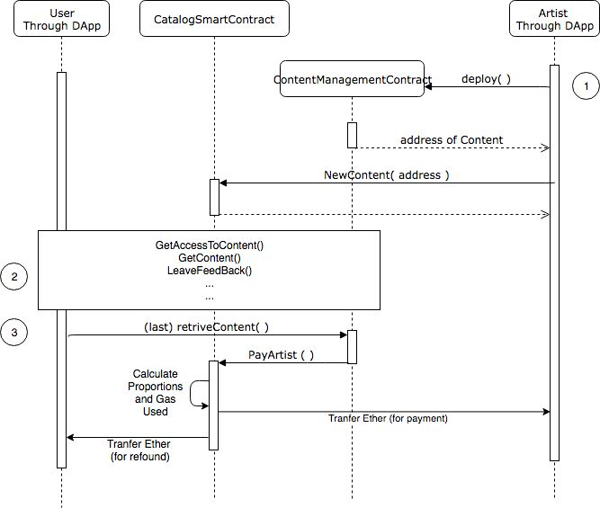

# COBrA Dapp

This is my project for the master course [Peer to peer systems and Blockchain](https://esami.unipi.it/esami2/programma.php?c=37721&aa=2018&cid=69&did=13)

## Specification

COBrA (Fair COntent Trade on the BlockchAin) is a decentralized content publishing service, which enables the authors of new contents to submit their creation (song, video, photo,...) and to be rewarded accordingly to customers’ fruition. The users of COBrA are:
* Customers: entities that wish to access new content. 
* Authors: creators of a new contents 

The same user can have different roles at the same time. Customers may buy two kinds of accounts: Standard and Premium. 
* Standard accounts require payment for every single content access request
*  while Premium accounts require the payment of a fixed sum covering a period of time, so enabling unrestricted access to any content for x time (expressed in block height difference) starting from the subscription time. 

Once a customer has obtained access to a content, it can consume the content, at most one time. Do note that granting access to contents and content consuming are two different operations, that can happen at different times. A customer can gift another customer, by buying access rights for someone else instead of itself, both for Standard and for Premium Accounts. Premium accounts cannot gift for free single contents to other users. Every user is notified when:
* It is gifted to him the access to a content
* It is gifted to him the premium account
* Where there is a new publication from a particular artist or a particular genre (he has to register to these events)
* He can register a feedback

## How to deploy

### Localhost

 * Get a local blockchain using [Ganache](https://truffleframework.com/ganache)
 * Use [Remix](https://remix.ethereum.org/) to deploy the contract `./src/Solidity/CatalogSmartContract.sol` in the new local blockchain

### Real blockchain

You can use [Parity](https://www.parity.io/)

 * Get an Ethereum node in few hours `parity --chain ropsten --mode active --tracing off --pruning fast --db-compaction ssd --cache-size 2048`
 * Run it `parity --chain ropsten --ws-interface all --ws-apis web3 --jsonrpc-hosts all --ws-origins all --wshosts all --jsonrpc-interface all --jsonrpc-cors null`
 *  * Use [Remix](https://remix.ethereum.org/) to deploy the contract `./src/Solidity/CatalogSmartContract.sol` in the Ropstan Blockchain

## How to use 

Once the CatalogSmartContract is deployed:

 * Copy the address the the new contract in the variable `catalogAddress` in the file `./src/misc/ABIandAdresses`
 * Be sure to have an active provider on localhost:8545 that support websocket (for example with [Geth](https://geth.ethereum.org/): `geth ... --ws`)
 * Run the DApp opening the web page `./src/index.html` 
  
For new Content (and so for new ContentManagementContract) the user can easyly choose `./src/misc/ContentManagementContract.json` if the user wants an other Contract he can write it (it must extend ContentManagementContract) and compile it with using [solc](https://solidity.readthedocs.io/en/v0.5.3/using-the-compiler.html):

`solc <name>.sol --combined-json abi,asm,ast,bin,bin-runtime,clone bin,devdoc,interface,opcodes,srcmap,srcmap-runtime,userdoc > <name>.json`

## General Organization 

As you can see in the previous figure COBrA DApp include, for the frontend a webpage with which the user can interact written using Javascript, CSS, Bootstrap and JQuery. The most important library is [web3.js](https://web3js.readthedocs.io/en/1.0/) (version 1.0.0 beta 33) that interact with an Ethreum node using RPC. As much as I could, I followed the principle for a good design of a DApp, at this [link](https://medium.com/@lyricalpolymath/web3-design-principles-f21db2f240c1). For the backend there are two contracts: CatalogSmartContract.sol and ContentManagementContract.sol.
The first one does the following jobs:
* Manage payments
* Contain addresses and names of the Content
* Be in the middle between users and contents
* Retrieve data for statistics purpose
* Notify user of the various events

The second one does the following jobs:
* Contain authorization 
* Contain other pieces of information (dates, visualizations, feedback, etc.)
* Provide content to the right users
* Register feedbacks
* Provide data to the Catalog

## Use case diagram 

### Sequence diagram 1
Sequnce for the sequence of action: the user becomes premium, gets a content and gives feedback.

### Sequnce diagram 2
Sequnce for the sequence of action: the user artist creates a content and after `n` visualizations gets payed,

For more information read the [Report](doc/Report.pdf), unfortunately, it is in Italian.
